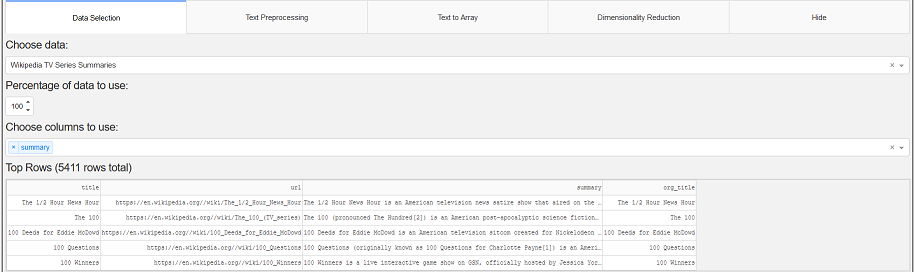
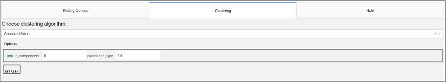
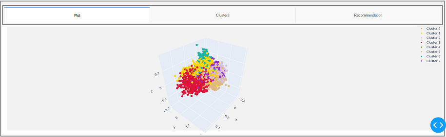
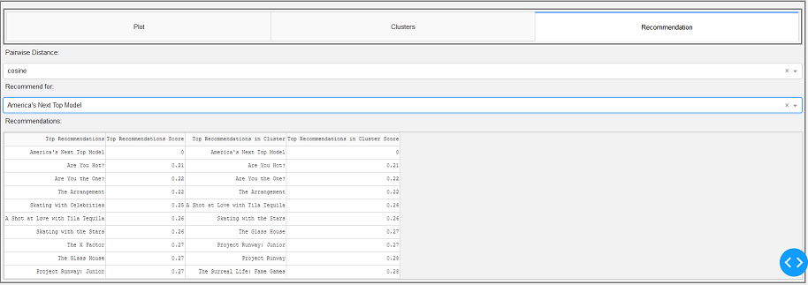

# Clustering Dashboard 
Simple dashboard for exploring dimesionality reduction and clustering methods. 

## Description
The dashboard is implemented using [Plotly Dash](https://plot.ly/dash/). Dimensionality reduction / clustering methods
are from [scikit-learn](https://scikit-learn.org/stable/), and there is an optional word2vec functionality using 
[fasttext](https://fasttext.cc/). Also there is some text preprocessing using [NLTK](https://www.nltk.org/).

At the moment the dashboard only has a single dataset: tv series summaries from Wikipedia. When the dataset is first 
selected in the app, it will scrape Wikipedia for summaries (can take quite some time, see output..). The summaries are 
saved locally in a csv file. The app also supports only including tv series which are listed in the top 250 IMDB 
tv series. 

## Dashboard structure
The dashboard consists of three parts:
1. Data selection / preprocessing / dimensionality reduction
  
2. Plotting / clustering
 
3. Visualization / cluster information / "Recommendation"

 

## Installation
### Clone repository
 
`git clone https://github.com/Rotaro/ClusteringDashboard`

### Install necessary packages
 
#### Using pip:

`pip install -r requirements.txt`

## Starting dashboard

Using the flask server packaged with Dash:
`python dashboard/app.py`

The dashboard is then running locally on port 8050 by default, i.e. navigate to:

`https://localhost:8050`